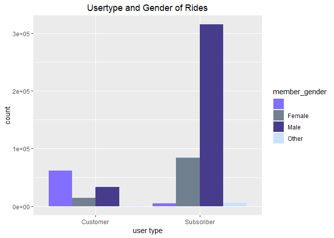
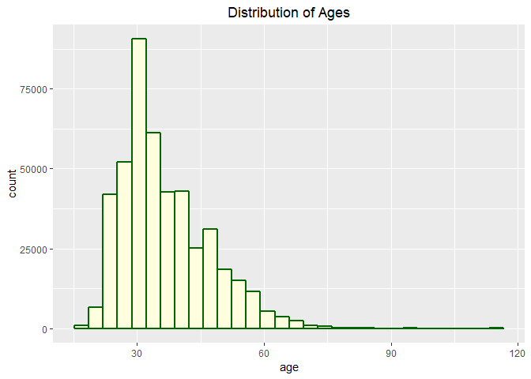
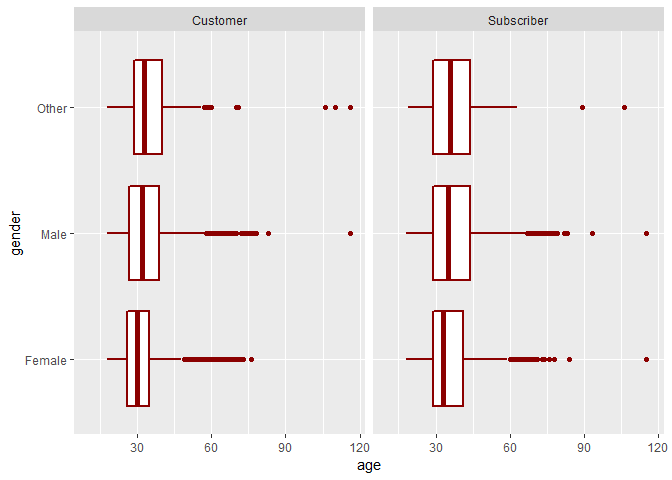
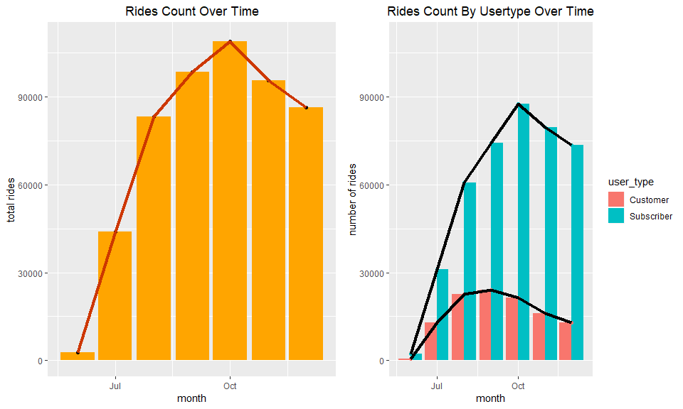
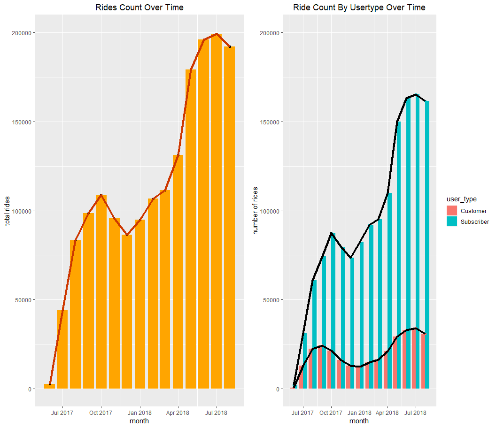
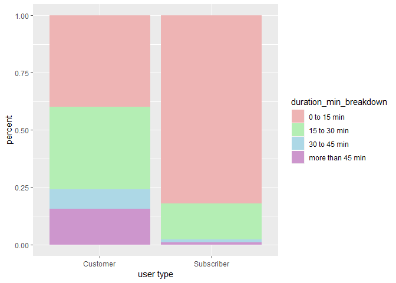
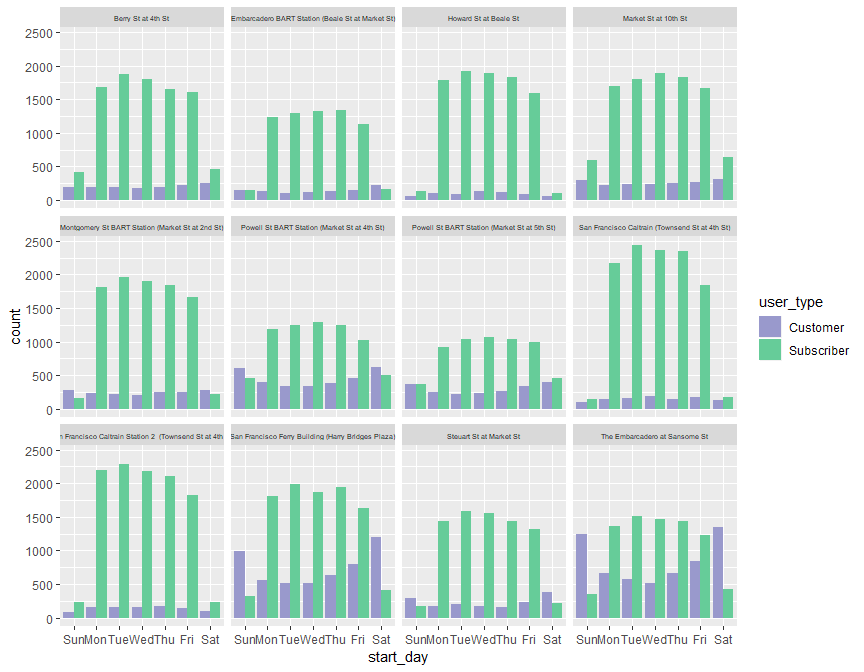
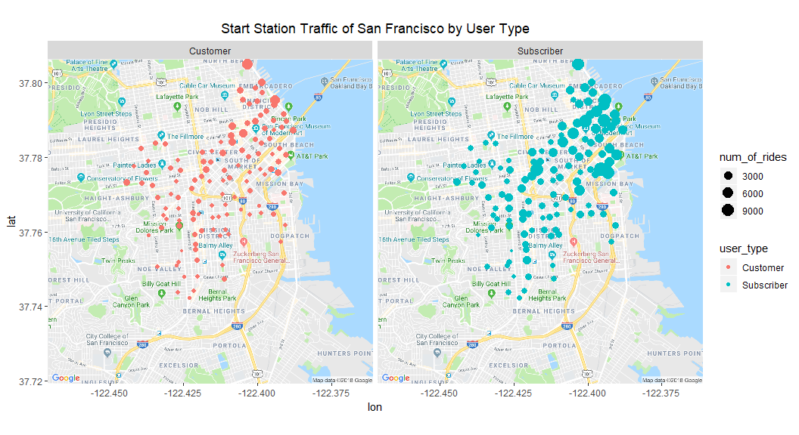
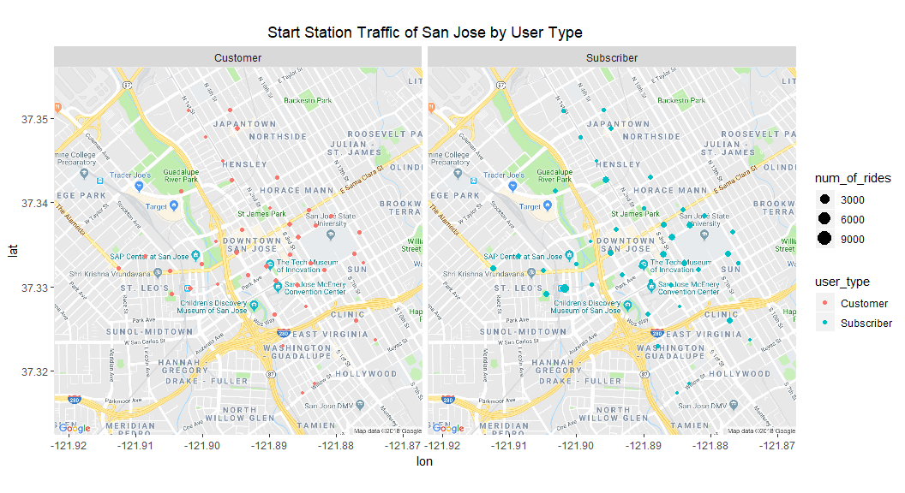
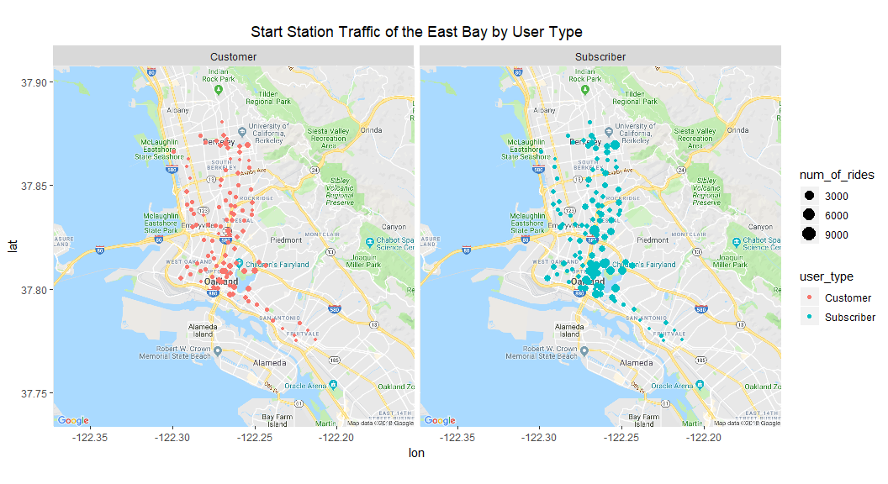

Exploratory Data Analysis on Ford GoBike Data
================
Amanda Shu
September 12, 2018

About Ford GoBike Data
----------------------

Ford GoBike, previously known as Bay Area Bike Share, is a bike share system currently implemented in San Francisco, East Bay, and San Jose. The `bike_17` data describes all the trips taken from operation's rebranding as Ford GoBike (June 28, 2017) until the end of the year (December 31, 2017). The data can be found on [Ford GoBike's website](https://www.fordgobike.com/system-data).

`bike_17` has 519,700 observations and 15 variables. Those variables are:

-   **duration\_sec** - the duration of the trip in seconds
-   **start\_time** - the date and time when the trip started
-   **end\_time** - the data and time when the trip ended
-   **start\_station\_id**
-   **start\_station\_name**
-   **start\_station\_latitude**
-   **start\_station\_longitude**
-   **end\_station\_id**
-   **end\_station\_name**
-   **end\_station\_latitude**
-   **end\_station\_longitude**
-   **bike\_id**
-   **user\_type** - the type of user can be a customer or subscriber
-   **member\_birth\_year**
-   **member\_gender**

And here is a glimspe of the data.

    ## Observations: 519,700
    ## Variables: 15
    ## $ duration_sec            <int> 80110, 78800, 45768, 62172, 43603, 922...
    ## $ start_time              <fct> 2017-12-31 16:57:39.6540, 2017-12-31 1...
    ## $ end_time                <fct> 2018-01-01 15:12:50.2450, 2018-01-01 1...
    ## $ start_station_id        <int> 74, 284, 245, 60, 239, 30, 259, 284, 2...
    ## $ start_station_name      <fct> Laguna St at Hayes St, Yerba Buena Cen...
    ## $ start_station_latitude  <dbl> 37.77643, 37.78487, 37.87035, 37.77452...
    ## $ start_station_longitude <dbl> -122.4262, -122.4009, -122.2678, -122....
    ## $ end_station_id          <int> 43, 96, 245, 5, 247, 30, 259, 284, 20,...
    ## $ end_station_name        <fct> San Francisco Public Library (Grove St...
    ## $ end_station_latitude    <dbl> 37.77877, 37.76621, 37.87035, 37.78390...
    ## $ end_station_longitude   <dbl> -122.4159, -122.4266, -122.2678, -122....
    ## $ bike_id                 <int> 96, 88, 1094, 2831, 3167, 1487, 3539, ...
    ## $ user_type               <fct> Customer, Customer, Customer, Customer...
    ## $ member_birth_year       <int> 1987, 1965, NA, NA, 1997, NA, 1991, NA...
    ## $ member_gender           <fct> Male, Female, , , Female, , Female, , ...

A look into the dataset shows that it has missing values in the birth year and gender columns. Specifically, there are 66,541 NAs in "member\_bith\_year" and 66,462 empty strings in "member\_gender". In the interest of keeping all of the data, I will not omit the missing values right now.

Ride Demographics
-----------------

In this section I will look into the user type, gender, and age of the rides taken.

The rides' user type may classified as either a customer or a suscriber, depending on whether or not they purchase rides individually or pay more as a monthly subscriber to get unlimited rides. There are 110,470 rides from customers and 409,230 from subscribers. *Note that these are not the number of customers and subscribers. Since each observation is a single ride rather than each individual rider, a rider may take several rides and each ride would count as an observation. Thus I cannot say how many customers and subscribers Ford GoBike has, but rather how many rides were taken by customers and subscribers respectively.*

It is clear from the graph below that the majority of rides taken are by subscribers, which makes sense since they are the users who routinely ride (and thus would contribute more observations into the dataset). However, regardless of user type, there are more rides are taken by males than females.

Also, note that the highest count for customers are of observations with empty strings in the gender column as seen in the graph below. The reason for this is unknown, but I can guess that perhaps customers are less willing to fill our their gender information if they are not committing to this bike share system.



In fact, 61735 of the 66541 of the empty strings in the gender columns are from customers. Not including observatios with missing values in analysis runs a risk of bias if there is a lurking variable, which is a problem I will encounter when I look at ages of rides next.

    ##             
    ##                     Female   Male  Other
    ##   Customer    61735  14762  33063    910
    ##   Subscriber   4727  83859 315255   5389

`bike_17_ages` includes a new column called "member\_age", which estimates the rider ages by using the formula
*m**e**m**b**e**r**a**g**e* = 2017 − *b**i**r**t**h**y**e**a**r*
 I kept the ride observations where the member age was below 117 (the age of the oldest person alive) to get rid of unrealistic outliers. *Note that this action also omits observations with missing values in the age column. Thus, the histogram and the boxplots below would not be an accurate representation of the ages of Ford GoBike's rides if there is a lurking variable between customers and their age.*

``` r
# create age column: bike_17_ages
bike_17_ages <- bike_17 %>%
  mutate(member_age=2017-member_birth_year) %>%
  filter(member_age<117) 
```

Here is the distribution of the ages of all of the rides, which is right skewed. The median age of the rides is 34. *As mentioned before, this does not mean the median age of Ford GoBike's users is 34, but rather the median age of all the rides is 34.*



``` r
#median of ride ages
median(bike_17_ages$member_age)
```

    ## [1] 34

Below are boxplots for each gender-user type combination. There is no significant difference in where each median or the middle 50% of the data lies. Whether a rider is a customer or subscriber and female, male, or other, the median age of the rides taken is in the 30s.



Here are the specific median values.

    ## # A tibble: 6 x 3
    ## # Groups:   member_gender [?]
    ##   member_gender user_type  median_age
    ##   <fct>         <fct>           <dbl>
    ## 1 Female        Customer           30
    ## 2 Female        Subscriber         33
    ## 3 Male          Customer           32
    ## 4 Male          Subscriber         35
    ## 5 Other         Customer           33
    ## 6 Other         Subscriber         36

User Growth
-----------

I am curious to know how Ford GoBike's is growing, so I will graph their ride count of each month. Remember that Ford GoBike began in June 2017 and `bike_17` is the ride data until the end of 2017.

I added a "month" column to `bike_17` that describes the month when each ride started, resulting in a dataset called `bike_17_months`.

``` r
#add months column: bike_17_months
bike_17_months <- bike_17 %>%
  mutate(start_time= ymd_hms(start_time),
         month=floor_date(start_time, unit="1 month")) 
```

The graph on the left shows the number of rides taken by each month while the graph on the right breaks the counts by user type. Beginning in June, the rides increased rapidly month by month until after October when it dipped. The customer and subscriber counts followed the same shape, although the customer ride count peaked a month earlier in September.



My initial thought was that the dip occured because most people have tried out the bikes and have decided whether or not they would stick with it, hence the dip. If this is true, the ride counts should level out into a straight line. I want to see where this trend is going. Luckily, Ford GoBike releases monthly data in 2018. I joined the data from Jan to Aug 2018 to `bike_17` create a new dataset called `bike_18`. This has all the rides from Ford GoBike's rebranding start in June 2017 to present, Aug 2018. It is interesting that the ride count increased such as it did in the beginning months, but then dipped again. Perhaps, the second incline is due to more bicycles being introduced and it declined after the people have seen the bikes in the area for a few months. Or it could be that that users are less likely to bike when it is cold or rainy, hence the dips in the winter months. However, I would need more information on when Ford GoBike expands their bike system to different areas and several years of data to see if seasonal biking is true.



Ride Durations
--------------

To look at ride durations, I created `bike_17_min`, which is `bike_17` mutated to have a new column called "duration\_min" that measures the ride durations in minutes using the formula
*d**u**r**a**t**i**o**n**m**i**n* = *d**u**r**a**t**i**o**n**s**e**c*/60

``` r
#add ride duration in minutes column: bike_17_min
bike_17_min <- bike_17 %>%
  mutate(duration_min=duration_sec/60)
```

I was suprised to see the range of ride durations. The longest ride taken was 1439 minutes, or 23.98 hours. It does not seem plausible for someone to ride this long so my guess is that the rider forgot to dock the bike to the station to end the ride.

``` r
#find longest ride duration
head(bike_17_min %>%
  arrange(desc(duration_min))) %>%
  select(duration_min)
```

    ## # A tibble: 6 x 1
    ##   duration_min
    ##          <dbl>
    ## 1        1439.
    ## 2        1439.
    ## 3        1439.
    ## 4        1438.
    ## 5        1438.
    ## 6        1437.

How long do customers ride for? Customers can pay for a 30 minute ride or buy a 1 day pass for unlimited 30 minute rides for 24 hours (going over 30 minutes would result in a fee for each additional 15 minutes of riding). Since these options are marketed as "perfect for the explorer", I believe customers are either tourists riding to travel between their desired destinations or locals who want to try out the bikes before subscribing. Note that it is unclear from the dataset whether each ride with the usertype customer is classified as an individual ride or a day pass. Regardless, 76% of customers rode for 30 minutes or less.

``` r
#calculate percent of customer rides that were 30 minutes or less
bike_17_min %>%
  mutate(duration_min_breakdown=case_when(
    duration_min <= 30 ~ "30 min or less",
    duration_min > 30 ~ "more than 30 min"
  ))  %>%
  group_by(user_type) %>%
  mutate(total_riders=n()) %>%
  count(user_type, duration_min_breakdown, total_riders) %>%
  mutate(percent=n/total_riders) %>%
  filter(user_type=="Customer")
```

    ## # A tibble: 2 x 5
    ## # Groups:   user_type [1]
    ##   user_type duration_min_breakdown total_riders     n percent
    ##   <fct>     <chr>                         <int> <int>   <dbl>
    ## 1 Customer  30 min or less               110470 83991   0.760
    ## 2 Customer  more than 30 min             110470 26479   0.240

How long do subscribers ride for? Subscribers have unlimited 45 minute rides. Since the monthly membership is marketed as the "Best deal for locals", I believe that people who pay more to become subscribers are those who ride often, perhaps as quick part of their daily routine, such as riding to work or school. Thus, it is not suprising that over 99% of subscriber rides lasted for less than 45 minutes. This also means 1% percent of subscriber rides had an over the time limit charge compared to 24% of customer rides. Perhaps, some new customers were unaware of the fee and rode for longer. Subscribers, on the other hand, have experience with the system and stick to riding under 45 minutes.

``` r
#calculate percent of subscriber rides who ride 45 minutes or less
bike_17_min %>%
  mutate(duration_min_breakdown=case_when(
    duration_min <= 45 ~ "45 min or less",
    duration_min > 45 ~ "more than 45 min"
  ))  %>%
  group_by(user_type) %>%
  mutate(total_riders=n()) %>%
  count(user_type, duration_min_breakdown, total_riders) %>%
  mutate(percent=n/total_riders) %>%
  filter(user_type=="Subscriber")
```

    ## # A tibble: 2 x 5
    ## # Groups:   user_type [1]
    ##   user_type  duration_min_breakdown total_riders      n percent
    ##   <fct>      <chr>                         <int>  <int>   <dbl>
    ## 1 Subscriber 45 min or less               409230 405649 0.991  
    ## 2 Subscriber more than 45 min             409230   3581 0.00875

Broken down further, over 75% of subscribers ride for less than 15 minutes while only over 30% of customers do. Subscribers ride for very short durations, with barely any rides lasting between 30 to 45 minutes. Thus, it does not seem necessary to give suscribers 45 minutes rides compared to a customer's 30 minutes ride. I can see people feeling more inclined to become a subscriber after seeing the extended time limit, but in reality subscribers don't need the extra 15 minutes.



Station Traffic
---------------

Below are the top 12 stations with the most rides. I saved their station ids into `top12` to use later.

``` r
#find the top 12 stations with most rides
head(bike_17 %>%
  group_by(start_station_name) %>%
  summarise(rider_count=n()) %>%
  arrange(desc(rider_count)),n=12)
```

    ## # A tibble: 12 x 2
    ##    start_station_name                                        rider_count
    ##    <fct>                                                           <int>
    ##  1 San Francisco Ferry Building (Harry Bridges Plaza)              15187
    ##  2 The Embarcadero at Sansome St                                   13664
    ##  3 San Francisco Caltrain (Townsend St at 4th St)                  12546
    ##  4 San Francisco Caltrain Station 2  (Townsend St at 4th St)       12055
    ##  5 Market St at 10th St                                            11960
    ##  6 Montgomery St BART Station (Market St at 2nd St)                11334
    ##  7 Berry St at 4th St                                              10956
    ##  8 Powell St BART Station (Market St at 4th St)                    10142
    ##  9 Howard St at Beale St                                            9926
    ## 10 Steuart St at Market St                                          9347
    ## 11 Powell St BART Station (Market St at 5th St)                     7987
    ## 12 Embarcadero BART Station (Beale St at Market St)                 7649

``` r
#save their ids
top12 <- c(15,6,30,67,58,21,81,3,22,16,5,17)
```

In these top 12 stations, I would like to see their ride count by the day of the week. `bike_17_days` adds a column to `bike_17` that describes the day of the week when the ride started.

``` r
#add days column: bike_17_days
bike_17_days <- bike_17 %>%
  mutate(start_day=wday(bike_17$start_time, label=TRUE), 
         end_day=wday(bike_17$end_time, label=TRUE))
```

These are the number of rides taken at the top 12 stations by each day of the week. Clearly, subscribers mainly ride during the weekdays, which concurs with my earlier presumption that subscribers are likely to be locals biking to work or school. There are a few stations (Powell St BART, Steuart St at Market St, Ferry buidling, and the Embarcadero) in which the customer count jumps during the weekends. It makes sense that there are more customer rides over the weekend since these stations are all in areas of San Francisco where tourists often visit.



I also want to see the ride counts for all the stations to gain more insights on where stations get the most ride counts. I will split it up by San Francisco, San Jsoe, and the East Bay.

The maps below shows all the stations in San Francisco, with the size of each dot representing the number of rides in that station. It seems that subscriber rides are heavy in areas towards the bay and along Market Street. Customer rides frequent in few spots along Market Street as well. This make sense, as Market Street is the major street in San Francisco.



In San Jose, however, the ride traffic of stations is lower than that of San Francisco, seen from the size of the dots. For customers, ride count does not vary much between stations either. Perhaps since there are no tourist spots in this area, there is not reason to have high customer counts. Subscriber rides vary slightly between stations, with more rides around San Jose State Universtiy. Presumably, these subscribers are students riding between classes. The largest dot for subscribers is at the San Jose Diridon Station, which is a station for the Amtrak train. Perhaps these subscribers are those who regularly commute on train and ride elsewhere.



In the East Bay, for both customers and subscribers, there are clusters of higher traffic of stations in Oakland, which is not surprising given it is also a tourist city. Stations around UC Berkeley also have higher ride counts, which is again, presumably students riding to and from their classes.



Conclusion
----------

Here are some takeaways from my analysis of the Ford GoBike data

-   110,470 rides are from customers and 409,230 are from subscribers
-   more rides are taken by males over females and others
-   the median age of the rides is 34
-   ride counts per month have increased and dipped twice so far
-   over 75% of subscribers ride short durations (less than 15 minutes) and very little subscribers utilize the full 45 minute ride time
-   in the top 12 stations with the most rides, subscribers mainly ride on the weekdays, while a few stations near tourist destinations see an increase in customer rides on weekends
-   in general there is higher ride counts at stations in areas with tourists as well as areas near universities and train stations

Works Cited
-----------

I used the package ggmap to create the geospatial visualisation as well as Ford GoBike's website for the pricing information.

D. Kahle and H. Wickham. ggmap: Spatial Visualization with ggplot2. The R Journal, 5(1), 144-161. URL <http://journal.r-project.org/archive/2013-1/kahle-wickham.pdf>

Motivate International, Inc. <https://www.fordgobike.com/>

Thanks for reading!
-------------------

If you have any feedback or points for me to improve on please let me know. Thanks!
